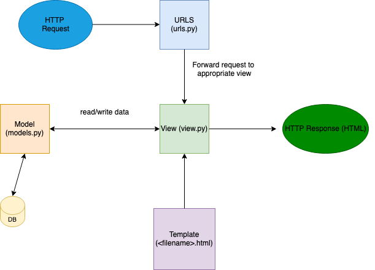
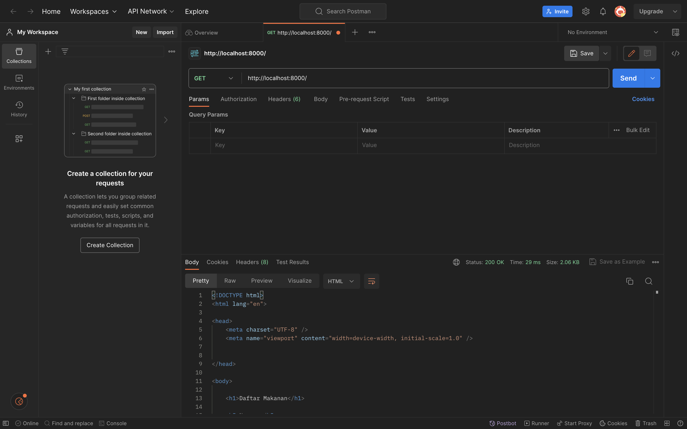
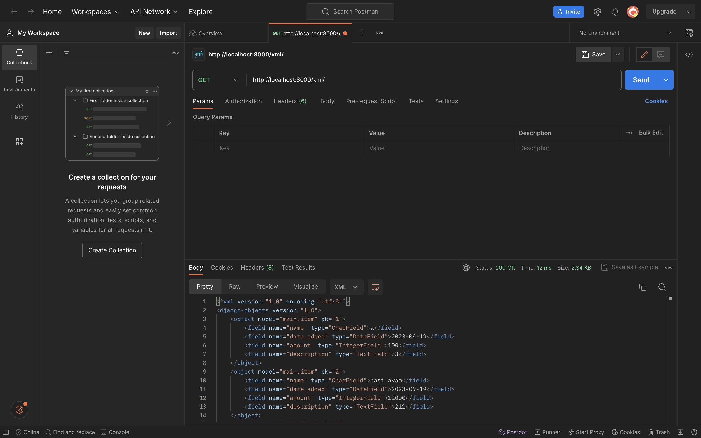
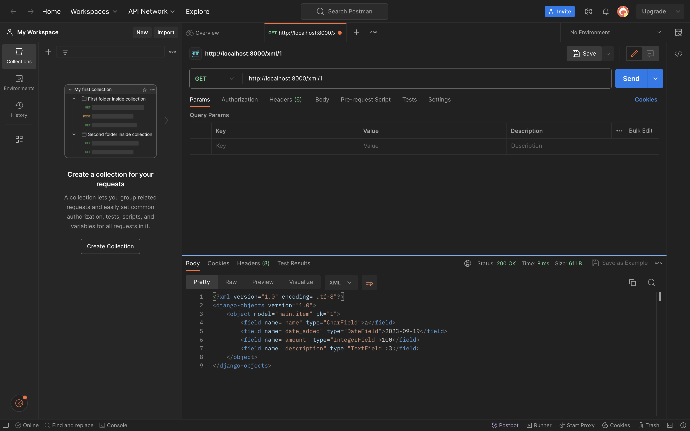
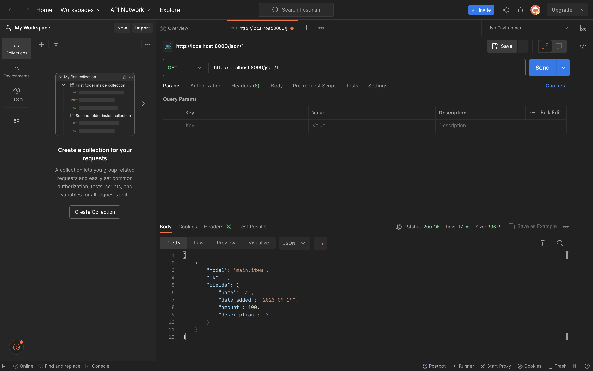

Nama    : Muhammad Nanda Pratama

NPM     : 2206081654

Kelas   : PBP C  

TUGAS 2

1. Jelaskan bagaimana cara kamu mengimplementasikan checklist di atas secara step-by-step (bukan hanya sekadar mengikuti tutorial).  
Jawaban: Saya mengikuti cara yang ada di tutorial dengan ada perubahan sedikit untuk tugas 2 ini, yaitu untuk nama git repository menjadi inventorypower, nama project django menjadi inventorypower, dan tampilan _webpage_ nya.  
Membuat sebuah proyek Django baru: Saya membuat proyek Django baru yang bernama inventorypower dengan cara yang mirip dengan tutorial, namun dengan nama inventorypower.  
Membuat aplikasi dengan nama main pada proyek tersebut: Untuk ini, saya mengikuti cara yang ada di tutorial, yaitu dengan memasukkan perintah "python manage.py startapp main", kemudian saya mendaftarkan aplikasi main dengan menambahkan 'main', di settings.py.  
Melakukan routing pada proyek agar dapat menjalankan aplikasi main: Saya mengikuti cara di tutorial 1, yaitu dengan mengubah kode urls.py di direktori inventorypower sesuai dengan di contoh tutorial.  
Membuat model pada aplikasi main dengan nama Item dan memiliki atribut wajib seperti dijelaskan di tugas 2: Saya mengikuti cara tutorial, hanya saja ada yang saya ubah, yaitu nama model menjadi Item, dimana di tutorial bernama Product. Selain itu, saya juga menambahkan atribut wajib seperti yang dijelaskan di tugas 2, yaitu name, amount, dan description.  
Membuat sebuah fungsi pada views.py untuk dikembalikan ke dalam sebuah template HTML yang menampilkan nama aplikasi serta nama dan kelas: Saya mengikuti cara yang tutorial dengan perubahan untuk tugas 2 ini, yaitu pada fungsi show_main, yang berisi context _dictionary_ yang disesuaikan untuk tampilan aplikasi saya.  
Membuat sebuah routing pada urls.py aplikasi main untuk memetakan fungsi yang telah dibuat pada views.py: Saya mengikuti cara tutorial, yaitu saya menambahkan pemetaan fungsi show_main dari main.views untuk tampilan yang akan ditampilkan ketika diakses.  
Melakukan _deployment_ ke Adaptable terhadap aplikasi yang sudah dibuat sehingga nantinya dapat diakses oleh teman-temanmu melalui Internet: Adaptable saya tidak bisa dibuka, jadi saya tidak bisa melakukan _deployment_ untuk tugas 2 ini.  


2. Buatlah bagan yang berisi request client ke web aplikasi berbasis Django beserta responnya dan jelaskan pada bagan tersebut kaitan antara urls.py, views.py, models.py, dan berkas html.  
Jawaban:   
  
urls.py digunakan untuk mengatur alur permintaan dari pengguna _client_ (HTTP Request). Pada urls.py ini, kita mengonfigurasi _routing_ URL pada aplikasi.  
views.py digunakan untuk mendefinisikan _dictionary_ context pada fungsi show_main yang akan ditampilkan di aplikasi. Fungsi show_main juga melakukan _return_ yang bertujuan untuk me-_render_ tampilan Template (berkas HTML).  
models.py digunakan untuk mendefinisikan model-model database yang digunakan pada aplikasi. Data dari database hanya boleh diambil dari models.py, tidak boleh langsung dari views.py, sehingga jika views.py ingin menggunakan data dari database, views.py harus meminta dari models.py terlebih dahulu.  
Berkas HTML digunakan untuk menampilkan data dan tampilan ke pengguna _client_.  

3. Jelaskan mengapa kita menggunakan _virtual environment_? Apakah kita tetap dapat membuat aplikasi web berbasis Django tanpa menggunakan _virtual environment_?  
Jawaban: Kita menggunakan _virtual environment_ supaya untuk mengisolasi dari _environment_ utama atau _virtual enviroment_ lainnya. Hal ini sangat penting dilakukan karena tiap _project_ Django memiliki _dependecies_ yang berbeda-beda, sehingga dengan adanya _virtual environment_ ini, bisa mencegah adanya tumpang tindih _dependecies_ dengan _project_ Django lainnya. Kita tetap bisa menggunakan Django tanpa menggunakan _virtual environment_, hanya saja ketika aplikasi _web_ kita menggunakan Django versi A, sedangkan proyek baru yang ingin dikerjakan menggunakan Django versi B, tentu tidak mungkin menggunakan 1 _environment_ saja karena tiap versi Django memiliki _dependecies_ yang berbeda-beda.  

4. Jelaskan apakah itu MVC, MVT, MVVM dan perbedaan dari ketiganya.  
Jawaban: MVC (Model,View,Controller) adalah konsep pada pembuatan aplikasi yang terdiri dari  
Model: Model untuk mendefinisikan model-model database yang digunakan pada aplikasi.  
View: View ini merupakan tampilan yang akan dilihat oleh _user_
Controller: Controller ini merupakan penghubung antara View dan Model. Contohnya, ketika _user_ mengklik suatu tombol di aplikasi, Controller yang mengatur supaya _event_ tersebut masuk ke Model dan hasilnya ditampilkan di View.  
MVT (Model,View,Template) adalah konsep pada pembuatan aplikasi yang terdiri dari
Model: Definisinya sama dengan Model pada konsep MVC, yaitu untuk mendefinisikan model-model database yang digunakan pada aplikasi.  
View: View untuk mendefinisikan _dictionary_ context pada fungsi show_main yang akan ditampilkan di aplikasi dan me-_render_ tampilan Template (berkas HTML). View pada MVT ada kemiripan dengan Controller pada MVC, namun tetap ada perbedaan dalam tugasnya.
Template: Merupakan berkas HTML yang mengatur bagaimana data dari Model dan isi _dictionary_ di View ditampilkan, hasil HTML yang sudah jadi (HTML Response) akan dikirimkan ke _user_.  
MVVM (Model,View,ViewModel) adalah konsep pembuatan aplikasi yang terdiri dari  
Model: Konsepnya hampir sama dengan Model pada MVC dan MVT, yaitu untuk mendefinisikan model-model database yang digunakan pada aplikasi. Namun tetap ada perbedaan dengan konsep Model pada MVC dan MVT.
View: Menampilkan data kepada _user_, tetapi cenderung lebih pasif dan tidak bisa langsung akses ke Model, melainkan lewat perantara ViewModel.  
ViewModel: ViewModel merupakan perantara antara Model dan View. Tugasnya untuk mempersiapkan data dari Model untuk ditampilkan di View.


Untuk testing, saya menambahkan testing test_main_not_contains_unexpected_text untuk teks yang tidak boleh ada di halaman '/main/'

Sumber: https://developer.mozilla.org/en-US/docs/Learn/Server-side/Django/Home_page  

TUGAS 3  
1. Apa perbedaan antara form POST dan form GET dalam Django?  
Jawaban: GET dan POST sama-sama merupakan metode HTML. POST lebih aman daripada GET karena nilai variabel pada POST tidak ditampilkan di URL sedangkan pada GET, nilai variabel ditampilkan di URL. Selain itu, String pada POST juga tidak dibatasi, berbeda dengan GET yang dibatasi hingga 2047 karakter. Secara penggunannya, POST lebih digunakan untuk mengirim data-data yang sentitif contohnya kode, sedangkan GET lebih digunakan untuk mengirim data yang tidak sentitif contohnya seperti Web bacaan.  

2. Apa perbedaan utama antara XML, JSON, dan HTML dalam konteks pengiriman data?  
Jawaban: - XML _(Extensible Markup Language)_ merupakan _markup languange_ yang mirip dengan HTML, namun dia tidak mengutamakan tampilan seperti HTML. XML biasanya digunakan untuk pertukaran data pada aplikasi _Web_. XML juga memiliki tag pembuka dan penutup yang mirip dengan HTML.  
- JSON _(JavaScript Object Notation)_ merupakan format data yang juga sering digunakan pada pemograman _web_. JSON lebih sederhana dan lebih mudah dibaca oleh manusia, dan juga lebih cepat diproses oleh komputer daripada XML. Isi JSON umumnya berupa Array dalam JavaScript, jadi lebih _familiar_ untuk para ahli pemograman _web_.  
- HTML _(Hypertext Markup Language)_ digunakan untuk menampilkan data berupa tampilan di _web_. HTML lebih berfokus kepada penampilan Aplikasi _Web_ yang akan ditampilkan ke _user_.  

3. Mengapa JSON sering digunakan dalam pertukaran data antara aplikasi web modern?  
Jawaban: JSON sering digunakan dalam pertukaran data antara aplikasi _web_ modern karena JSON cenderung sederhana dan mudah dibaca oleh manusia, selain itu juga mudah diproses oleh mesin (komputer). JSON juga memiliki ukuran yang cenderung ringan sehingga tidak membenani kinerja server ketika mengirimkan JSON.  

4. Jelaskan bagaimana cara kamu mengimplementasikan checklist di atas secara step-by-step (bukan hanya sekadar mengikuti tutorial).  
Jawaban: - Membuat input form untuk menambahkan objek model pada app sebelumnya : Saya mengikuti cara Tutorial 2 namun dengan perubahan sedikit untuk nama modelnya, jika di tutorial menggunakan nama "Product", di tugas 3 ini menggunakan nama "Item". Selain itu, saya juga menyesuaikan main.html pada penambahan formnya agar sesuai dengan aplikasi saya.  
- Tambahkan 5 fungsi views untuk melihat objek yang sudah ditambahkan dalam format HTML, XML, JSON, XML by ID, dan JSON by ID : Saya juga mengikuti cara Tutorial 2 namun dengan perubahan sedikit untuk nama modelnya seperti yang telah dijelaskan sebelumnya. jika dalam tutorial show_xml dan show_json menggunakan kode "data = Product.objects.all()", pada tugas saya ini, saya menggunakan "data = Item.objects.all()". Begitu juga dengan fungsi show_xml_by_id dan show_json_by_id, saya mengubah "data = Product.objects.filter(pk=id)" menjadi "data = Item.objects.filter(pk=id)".  
- Membuat routing URL untuk masing-masing views yang telah ditambahkan pada poin 2 : Saya mengikuti cara yang hampir sama dengan tutorial 2, namun ada pebedaan untuk bagian _import_, karena saya menggunakan nama Item untuk model saya, saya menggunakan "from main.views import show_main, create_item, show_xml, show_json, show_xml_by_id, show_json_by_id".  

Dibawah ini merupakan _screenshot_ dari hasil akses URL menggunakan Postman.





  


TUGAS 4

1. Apa itu Django UserCreationForm, dan jelaskan apa kelebihan dan kekurangannya? 
Jawaban: Django UserCreationForm digunakan untuk membuat form registrasi user yang akan mendaftar. Kelebihannya adalah membuat form registrasi menjadi lebih mudah dan cepat karena form registrasi sudah disediakan oleh Django untuk digunakan, sudah terintegrasi oleh Django, dan sudah bisa memvalidasi input username dan password pengguna secara otomatis. Kekurangannya adalah karena cenderung mudah dibuat, kita jadi lebih sulit untuk membuat kasus khusus untuk login, sehingga kita harus membuat form registrasi sendiri untuk melakukan itu.

2. Apa perbedaan antara autentikasi dan otorisasi dalam konteks Django, dan mengapa keduanya penting?  
Jawaban: autentikasi adalah proses memverifikasi identitas _user_ yang akan login. autentikasi bertujuan untuk memverifikas apakah _user_ tersebut adalah _user_ yang sah pada _web_ tersebut. Otorisasi adalah proses memverifikasi apakah _user_ dapat mengakses sesuatu di website tersebut, contohnya pada _website_ kuis, _user_ tidak memiliki akses untuk mengubah jawaban pada kuis yang bukan buatannya. Autentikasi dan otorisasi sangat penting karena bertujuan untuk melindungi data yang penting yang pada aplikasi _web_ tersebut.  

3. Apa itu _cookies_ dalam konteks aplikasi _web_, dan bagaimana Django menggunakan _cookies_ untuk mengelola data sesi pengguna?  
Jawaban: Cookies pada konteks aplikasi _web_ adalah data yang disimpan pada sisi _client_ untuk menyimpan informasi dan preferensi tentang _user_ tersebut. Hal ini mbembantu pihak dari _server_ _web_ tersebut untuk mengenali _user_ yang kembali ke aplikasi _web_ tersebut.  
Django menggunakan _cookies_ untuk mengelola data sesi pengguna secara otomatis, jadi ketika _user_ mengakses aplikasi _web_ tersebut, Django akan menyimpan informasi tentang _user_ tersebyt pada _cookies_, informasi otentikasi, atau preferensi pengguna.  
Cara Django menggunakan cookies untuk mengelola data sesi pengguna biasanya melibatkan langkah-langkah berikut:

    Membuat atau Memuat Sesi: Django akan membuat sesi pengguna secara otomatis ketika pengguna masuk atau berinteraksi dengan situs. Informasi sesi ini kemudian disimpan di server dan ID sesi-nya disematkan dalam cookie di sisi klien.

    Mengakses Data Sesi: Setelah sesi pengguna terbuat, Django bisa menyimpan atau mengambil data terkait sesi tersebut. Misalnya, data keranjang belanja, preferensi tampilan, atau informasi otentikasi.

    Menyimpan Data dalam Cookie: Informasi sesi yang diambil dari server akan dienkripsi (agar lebih aman) dan kemudian disimpan dalam cookie di sisi klien.

    Menggunakan Data Sesi: Setiap kali pengguna membuat permintaan (request) ke server, Django akan membaca cookie sesi, mengidentifikasi sesi pengguna, dan memungkinkan akses ke data sesi tersebut.

    Memperbarui atau Menghapus Data Sesi: Django juga bisa memperbarui atau menghapus data sesi pengguna sesuai dengan interaksi atau perubahan yang terjadi dalam aplikasi.


4. Apakah penggunaan _cookies_ aman secara default dalam pengembangan web, atau apakah ada risiko potensial yang harus diwaspadai?  
Jawaban: _Cookies_ secara default tidak sepenuhnya aman dalam pengembangan _web_, karena ada risiko potensial yang harus diwaspadai, terutama jika ada serangan XSS _(Cross Site Scripting)_, di mana penyerang dapat mengambil informasi pribadi dari _user_ dengan mengubah kode di halaman _web_ yang dieksekusi oleh browser _user_ tersebut.  

5. Jelaskan bagaimana cara kamu mengimplementasikan checklist di atas secara step-by-step (bukan hanya sekadar mengikuti tutorial).  
Jawaban:   
- Mengimplementasikan fungsi registrasi, login, dan logout untuk memungkinkan pengguna untuk mengakses aplikasi sebelumnya dengan lancar: Saya mengikuti hal-hal di tutorial namun saya memerhatikan kondisi untuk aplikasi saya.  
- Membuat dua akun pengguna dengan masing-masing tiga dummy data menggunakan model yang telah dibuat pada aplikasi sebelumnya untuk setiap akun di lokal: Saya sudah melakukannya dengan membuat dua akun, kemudian saya buat tiga dummy data.  
- Menghubungkan model Item dengan User: Saya mengikuti cara di tutorial dengan memperhatikan kondisi untuk aplikasi saya, pada aplikasi saya, namanya Item, bukan Product.
-  Menampilkan detail informasi pengguna yang sedang logged in seperti username dan menerapkan cookies seperti last login pada halaman utama aplikasi: Saya sudah mencobanya dan memperhatikannya, dan mirip dengan tutorial untuk ini.

TUGAS 5

1. Jelaskan manfaat dari setiap _element selector_ dan kapan waktu yang tepat untuk menggunakannya.   
Jawaban: Pada CSS (Cascading Style Sheet) Banyak terdapat _element selector_ yang dapat digunakan, di antaranya  
``````
- Tag Selector : Selector ini digunakan untuk memilih elemen menggunakan _tag_. Manfaatnya untuk membuat _styling_ untuk jenis _elemen_ tertentu.
- Class Selector : Selector ini digunakan untuk memilih _elemen_ menggunakan _class_. Manfaatnya adalah kita bisa memberikan _styling_ yang sama untuk beberapa elemen pada kelas yang sama tanpa harus mengulang kode CSS tersebut.  
- ID Selector : Selector ini mirip dengan Selector Class, hanya saja ID Selector ini untuk tiap ID yang bersifat unik, jadi tiap elemen memiliki ID nya sendiri. Manfaatnya untuk memberikan _styling_ pada elemen tertentu saja.  
- Universal Selector : Selector ini digunakan untuk memberikan _styling_ ke semua elemen di halaman _web_.  
- Pseudo-class Selector : Selector ini digunakan untuk memberikan _styling_ ketika ada kondisi tertentu, contohnya ketika kita menekan tombol di _keyboard_. Dengan _selector_ ini kita bisa menetapkan _styling_ ketika pada keadaan tersebut.  
- Pseudo-element Selector : Selector ini membuat _styling_ elemen semu di dalam elemen sebenarnya, Misalnya kita ingin memberikan _styling_ hanya sebagian pada 1 elemen tersebut, kita bisa menggunakan _selector_ ini untuk menerapkan _styling_ tersebut.  
``````

2. Jelaskan HTML5 Tag yang kamu ketahui.  
Jawaban: Ada beberapa HTML5 Tag yang perlu diketahui, di antaranya:  

- `<header>` : Tag ini digunakan untuk menampilkan _header_ pada bagian atas halaman _web_. Biasanya, _header_ diguanakan untuk meletakkan judul dan logo _web_ tersebut.
- `<nav>` : Tag ini digunakan untuk membuat _navigation bar_ pada aplikasi _web_.  
- `<video>` : Tag ini Untuk menampilkan video pada halaman _web_.  
- `<audio>` : Tag ini untuk memberikan _audio_ pada halaman _web_.  
- `<canvas>` : Tag ini digunakan untuk membuat grafis dan animasi langsung di halaman _web_ tersebut.
- `<div>` : Tag ini untuk mengelompokkan elemen pada halaman _web_. 


3. Jelaskan perbedaan antara _margin_ dan _padding_.  
Jawaban: Perbedaan antara _margin_ dan _padding_ adalah 

- Margin adalah ruang kosong di sekitar elemen pada HTML. Margin merupakan jarak antara elemen tersebut dengan elemen lain di sekitarnya.  
- Margin tidak memiliki warna _background_.  
- Margin memengaruhi ruang di luar elemen tersebut. Jadi, ketika kita memberikan margin atas pada sebuah elemen, hal itu itu akan menambahkan jarak di atas elemen tersebut.  
- Padding adalah ruang kosong di dalam elemen HTML tersebut. Padding merupakan jarak antara konten elemen dan tepi elemen itu sendiri.  
- Padding dapat memiliki warna _background_. Jadi, jika kita memberikan padding pada sebuah elemen dan memberikan warna _background_, warna tersebut akan muncul di dalam padding tersebut.
- Padding memengaruhi ruang di dalam elemen. Jadi, jika kita memberikan padding atas pada sebuah elemen, hal itu akan menambahkan jarak antara konten dan bagian atas elemen tersebut.  
Kesimpulannya adalah: Margin berhubungan dengan ruang di luar elemen tersebut, dan Padding berhubungan dengan ruang di dalam elemen tersebut.  


4. Jelaskan perbedaan antara _framework_ CSS Tailwind dan Bootstrap. Kapan sebaiknya kita menggunakan Bootstrap daripada Tailwind, dan sebaliknya?  
Jawaban: Perbedaan antara Tailwind dan Bootstrap adalah    

Pada Tailwind:


- Tailwind menggunakan pendekatan Utility-First, yang artinya kita menggunakan _class_ CSS kecil untuk mengatur tampilan elemennya.  
- Kuatnya kustomisasi: Tailwind memudahkan kita untuk menyesuaikan kustomiasi dengan sangat mendalam. Kita dapat mengubah setiap spesifik desain dengan mudah.  
- Cenderung ringan : Tailwind cenderung ringan karena hanya berhubungan dengan CSS yang diperlukan.

Pada Bootstrap:  

- Pendekatan Komponen: Bootstrap dibuat berdasarkan pendekatan komponen, yang artinya kita menggunakan kelas CSS yang sudah ditentukan untuk mengatur komponen seperti _navigation bar_.  
- Desain yang siap digunakan : Bootstrap memiliki desain bawaan yang bagus dan siap digunakan, ini tentu saja memudahkan karena kita tidak perlu melakukan banyak kustomisasi.  
- Integrasi dengan JavaScript : Bootstrap memiliki integrasi dengan JavaScript sehingga Bootsrap dapat memudahkan interaksi pada halaman _web_.  

Kesimpulannya adalah Tailwind lebih cocok digunakan jika kita cenderung ingin membuat desain sendiri pada aplikasi _web_ kita. Sedangkan Bootstrap lebih cocok digunakan jika kita ingin membuat _website_ yang bagus dengan waktu yang singkat.  

5. Jelaskan bagaimana cara kamu mengimplementasikan checklist di atas secara step-by-step (bukan hanya sekadar mengikuti tutorial).  
Jawaban: 
- Kustomisasi halaman login, register, dan tambah inventori semenarik mungkin. : Saya mengikuti cara di tutorial, namun dengan kustomisasi halaman tersebut sesuai dengan tema aplikasi saya.  
- Kustomisasi halaman daftar inventori menjadi lebih berwarna maupun menggunakan apporach lain seperti menggunakan Card. : Saya mencari caranya di sumber lain, dan saya pun mengkustomisasi halaman daftar inventori menjadi lebih berwarna, saya memilih warna biru muda.

TUGAS 6

1. Jelaskan perbedaan antara _asynchronous programming_ dengan _synchronous programming_.  
Jawaban: _Synchronous programming_ yaitu tugas yang dijalankan pada program tersebut harus dijalankan terlebih dahulu lalu kemudian bisa menjalankan tugas berikutnya. Contohnya, ketika ada perintah pertama dan perintah kedua, perintah pertama harus diselesaikan terlebih dahulu supaya bisa lanjut ke perintah kedua.
Sedangkan _asynchronous programming_ sifatnya lebih fleksibel. Kita bisa membuat program menjalankan tugas selanjutnya tanpa harus menunggu tugas sebelumnya selesai terlebih dahulu, contohnya, ketika ada perintah pertama dan perintah kedua, program tidak perlu menunggu perintah pertama selesai untuk menjalankan perintah kedua. 

2. Dalam penerapan JavaScript dan AJAX, terdapat penerapan paradigma _event-driven programming_. Jelaskan maksud dari paradigma tersebut dan sebutkan salah satu contoh penerapannya pada tugas ini.  
Jawaban: Event-driven Programming adalah paradigma pemograman yang alur programnya ditentukan berdasarkan _event_ yang terjadi, contohnya, pada JavaScript dan AJAX, kita _select_ button _new item_ untuk menambahkan item, yang artinya dalam kode, itu merupakan _event_ yang menjalankan fungsi untuk menambahkan _item_.  

3. Jelaskan penerapan _asynchronous programming_ pada AJAX.  
Jawaban: Pada AJAX, penerapan _asynchronous programming_ adalah ketika _browser_ meminta permintaan data dari _server_, JavaScript tidak harus menunggu tugas tersebut selesai terlebih dahulu, melainkan JavaScript bisa lanjut ke tugas berikutnya sambil menunggu data tersebut datang.  

4. Pada PBP kali ini, penerapan AJAX dilakukan dengan menggunakan Fetch API daripada _library_ jQuery. Bandingkanlah kedua teknologi tersebut dan tuliskan pendapat kamu teknologi manakah yang lebih baik untuk digunakan.  
Jawaban: Fetch API  menggunakan konsep _promises_, yang membuatnya lebih mudah dalam menangani respons _asynchronous_. Ini memungkinkan penanganan kesalahan yang lebih baik. Selain itu, Fetch API juga lebih banyak mendukung metode dan _header_ HTTP dibangkan dengan AJAX biasa. Fetch API juga merupakan teknologi terbaru karena baru diluncurkan ketika ECMAScript 2020. Sedangkan jQuery dirancang untuk menyederhanakan tugas-tugas yang melibatkan JavaScript di berbagai _browser_, sehingga perbedaan implementasi pada _browser_ yang berbeda tidak jadi masalah. Menurut saya, teknologi yang lebih baik saya gunakan adalah Fetch API, karena teknologinya paling baru dan mudah digunakan karena adanya fitur _promise_.

5. Jelaskan bagaimana cara kamu mengimplementasikan checklist di atas secara step-by-step (bukan hanya sekadar mengikuti tutorial).  
Jawaban: - Ubahlah kode cards data item agar dapat mendukung AJAX GET dan Lakukan pengambilan item menggunakan AJAX GET.: Saya melakukannya dengan mengikuti cara di tutorial, hanya saja isi htmlstring nya diganti menjadi sesuai dengan tugas 6 ini, yaitu menggunakan Card.  
- Buatlah sebuah tombol yang membuka sebuah modal dengan form untuk menambahkan item: Mirip dengan di tutorial, hanya saja saya mengubah sedikit agar sesuai dengan aplikasi _web_ saya.  
- Buatlah fungsi view baru untuk menambahkan item baru ke dalam basis data: Saya membuat fungsi yang bernama add_item_ajax untuk menambahkan item baru ke dalam basis data, isi dari fungsi tersebut saya sesuaikan sesuai Model pada item saya.
- Buatlah path /create-ajax/ yang mengarah ke fungsi view yang baru kamu buat: Caranya mirip dengan di tutorial, yaitu saya import dahulu fungsinya, kemudian menambahkan path create-item-ajax/ pada fungsi urls.py  
- Hubungkan form yang telah kamu buat di dalam modal kamu ke path /create-ajax/: Caranya mirip dengan di tutorial, yaitu saya menambahkan add_item_ajax pada fungsi _add_ itemnya sehingga di Fetch, dibuat seperti ini. "".  
-  Lakukan refresh pada halaman utama secara asinkronus untuk menampilkan daftar item terbaru tanpa reload halaman utama secara keseluruhan: Saya melakukannya dengan melakukan   
```js
fetch("", {
            method: "POST",
            body: new FormData(document.querySelector('#form'))
        }).then(refreshProducts)
```
- Melakukan perintah collectstatic: Saya sudah melakukannya dengan perintah `python manage.py collectstatic` pada _command line_.