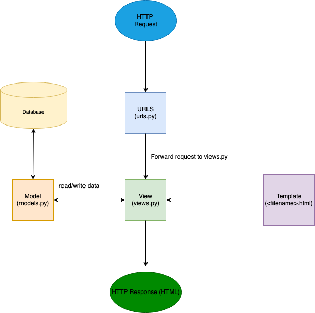

Nama    : Muhammad Nanda Pratama

NPM     : 2206081654

Kelas   : PBP C

1. Jelaskan bagaimana cara kamu mengimplementasikan checklist di atas secara step-by-step (bukan hanya sekadar mengikuti tutorial).  
Jawaban: Saya mengikuti cara yang ada di tutorial dengan ada perubahan sedikit untuk tugas 2 ini, yaitu untuk nama git repository menjadi inventorypower, nama project django menjadi inventorypower, dan tampilan _webpage_ nya.  
Membuat sebuah proyek Django baru: Saya membuat proyek Django baru yang bernama inventorypower dengan cara yang mirip dengan tutorial, namun dengan nama inventorypower.  
Membuat aplikasi dengan nama main pada proyek tersebut: Untuk ini, saya mengikuti cara yang ada di tutorial, yaitu dengan memasukkan perintah "python manage.py startapp main", kemudian saya mendaftarkan aplikasi main dengan menambahkan 'main', di settings.py.  
Melakukan routing pada proyek agar dapat menjalankan aplikasi main: Saya mengikuti cara di tutorial 1, yaitu dengan mengubah kode urls.py di direktori inventorypower sesuai dengan di contoh tutorial.  
Membuat model pada aplikasi main dengan nama Item dan memiliki atribut wajib seperti dijelaskan di tugas 2: Saya mengikuti cara tutorial, hanya saja ada yang saya ubah, yaitu nama model menjadi Item, dimana di tutorial bernama Product. Selain itu, saya juga menambahkan atribut wajib seperti yang dijelaskan di tugas 2, yaitu name, amount, dan description.  
Membuat sebuah fungsi pada views.py untuk dikembalikan ke dalam sebuah template HTML yang menampilkan nama aplikasi serta nama dan kelas: Saya mengikuti cara yang tutorial dengan perubahan untuk tugas 2 ini, yaitu pada fungsi show_main, yang berisi context _dictionary_ yang disesuaikan untuk tampilan aplikasi saya.  
Membuat sebuah routing pada urls.py aplikasi main untuk memetakan fungsi yang telah dibuat pada views.py: Saya mengikuti cara tutorial, yaitu saya menambahkan pemetaan fungsi show_main dari main.views untuk tampilan yang akan ditampilkan ketika diakses.  
Melakukan _deployment_ ke Adaptable terhadap aplikasi yang sudah dibuat sehingga nantinya dapat diakses oleh teman-temanmu melalui Internet: Adaptable saya tidak bisa dibuka, jadi saya tidak bisa melakukan _deployment_ untuk tugas 2 ini.  

2. Buatlah bagan yang berisi request client ke web aplikasi berbasis Django beserta responnya dan jelaskan pada bagan tersebut kaitan antara urls.py, views.py, models.py, dan berkas html.  
Jawaban:   
  
urls.py digunakan untuk mengatur alur permintaan dari pengguna _client_ (HTTP Request). Pada urls.py ini, kita mengonfigurasi _routing_ URL pada aplikasi.  
views.py digunakan untuk mendefinisikan _dictionary_ context pada fungsi show_main yang akan ditampilkan di aplikasi. Fungsi show_main juga melakukan _return_ yang bertujuan untuk me-_render_ tampilan Template (berkas HTML).  
models.py digunakan untuk mendefinisikan model-model database yang digunakan pada aplikasi. Data dari database hanya boleh diambil dari models.py, tidak boleh langsung dari views.py, sehingga jika views.py ingin menggunakan data dari database, views.py harus meminta dari models.py terlebih dahulu.  
Berkas HTML digunakan untuk menampilkan data dan tampilan ke pengguna _client_.  

3. Jelaskan mengapa kita menggunakan _virtual environment_? Apakah kita tetap dapat membuat aplikasi web berbasis Django tanpa menggunakan _virtual environment_?  
Jawaban: Kita menggunakan _virtual environment_ supaya untuk mengisolasi dari _environment_ utama atau _virtual enviroment_ lainnya. Hal ini sangat penting dilakukan karena tiap _project_ Django memiliki _dependecies_ yang berbeda-beda, sehingga dengan adanya _virtual environment_ ini, bisa mencegah adanya tumpang tindih _dependecies_ dengan _project_ Django lainnya. Kita tetap bisa menggunakan Django tanpa menggunakan _virtual environment_, hanya saja ketika aplikasi _web_ kita menggunakan Django versi A, sedangkan proyek baru yang ingin dikerjakan menggunakan Django versi B, tentu tidak mungkin menggunakan 1 _environment_ saja karena tiap versi Django memiliki _dependecies_ yang berbeda-beda.  

4. Jelaskan apakah itu MVC, MVT, MVVM dan perbedaan dari ketiganya.  
Jawaban: MVC (Model,View,Controller) adalah konsep pada pembuatan aplikasi yang terdiri dari  
Model: Model untuk mendefinisikan model-model database yang digunakan pada aplikasi.  
View: View ini merupakan tampilan yang akan dilihat oleh _user_
Controller: Controller ini merupakan penghubung antara View dan Model. Contohnya, ketika _user_ mengklik suatu tombol di aplikasi, Controller yang mengatur supaya _event_ tersebut masuk ke Model dan hasilnya ditampilkan di View.  
MVT (Model,View,Template) adalah konsep pada pembuatan aplikasi yang terdiri dari
Model: Definisinya sama dengan Model pada konsep MVC, yaitu untuk mendefinisikan model-model database yang digunakan pada aplikasi.  
View: View untuk mendefinisikan _dictionary_ context pada fungsi show_main yang akan ditampilkan di aplikasi dan me-_render_ tampilan Template (berkas HTML). View pada MVT ada kemiripan dengan Controller pada MVC, namun tetap ada perbedaan dalam tugasnya.
Template: Merupakan berkas HTML yang mengatur bagaimana data dari Model dan isi _dictionary_ di View ditampilkan, hasil HTML yang sudah jadi (HTML Response) akan dikirimkan ke _user_.  
MVVM (Model,View,ViewModel) adalah konsep pembuatan aplikasi yang terdiri dari  
Model: Konsepnya hampir sama dengan Model pada MVC dan MVT, yaitu untuk mendefinisikan model-model database yang digunakan pada aplikasi. Namun tetap ada perbedaan dengan konsep Model pada MVC dan MVT.
View: Menampilkan data kepada _user_, tetapi cenderung lebih pasif dan tidak bisa langsung akses ke Model, melainkan lewat perantara ViewModel.  
ViewModel: ViewModel merupakan perantara antara Model dan View. Tugasnya untuk mempersiapkan data dari Model untuk ditampilkan di View.

Untuk testing, saya menambahkan testing test_main_not_contains_unexpected_text untuk teks yang tidak boleh ada di halaman '/main/'

Sumber: https://developer.mozilla.org/en-US/docs/Learn/Server-side/Django/Home_page